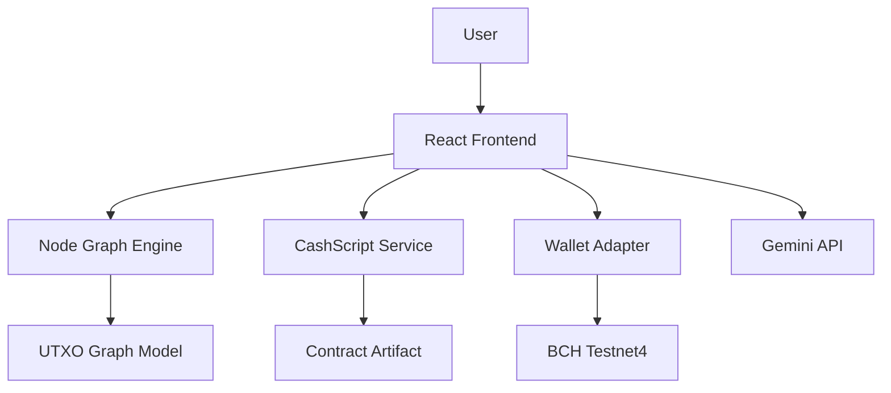

# Architecture: ProofMesh BCH

## High-Level Overview

ProofMesh follows a **Client-Side Logic** architecture typical of Web3 dApps. It does not rely on a centralized backend for contract logic; instead, it compiles CashScript templates in the browser and broadcasts transactions directly to the Bitcoin Cash network via the user's wallet provider.

## Core Components

### 1. Node Graph Engine (`App.tsx`)
- Manages state of `nodes` and `edges`.
- Represents the UTXO model: Inputs flow into Contracts, which flow into Outputs.
- Validates connections (e.g., cannot connect Output to Input directly without a locking script in between).

### 2. Contract Library (`lib/contracts.ts`)
- Contains parameterized CashScript templates.
- Implements PMv3 standards:
    - `checkDataSig` for oracles.
    - `tx.inputs` introspection for covenant enforcement.
    - `tokenCategory` checks for Cashtokens.

### 3. Services
- **Deployment**: Handles compilation (mocked in prototype) and broadcasting.
- **Gemini**: detailed prompt engineering to audit the graph topology for common UTXO attacks (e.g., dusting attacks, race conditions).

## Data Models

- **Node**: Represents a UTXO or Contract. Contains `code`, `parameters`, and `status`.
- **Edge**: Represents the spending path (Spending Transaction).
- **Project**: Collection of nodes/edges.

## Future Roadmap

1. **IPFS Integration**: Save graph configurations to IPFS for decentralized project sharing.
2. **Mainnet Launch**: Switch RPC endpoints to Mainnet.
3. **Verification**: Auto-verify contracts on a block explorer registry.
